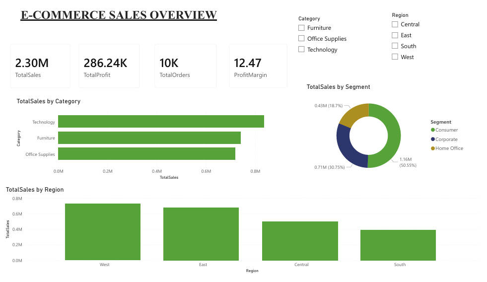
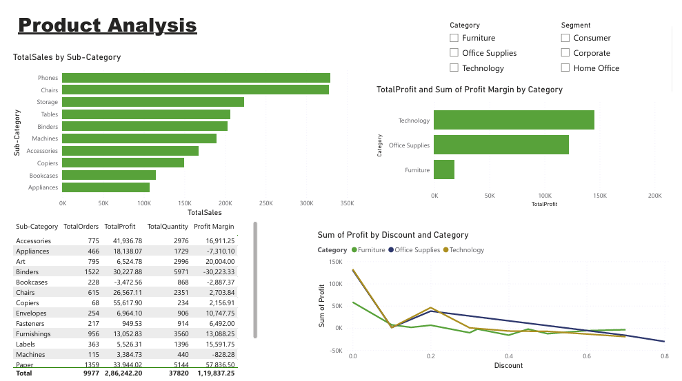
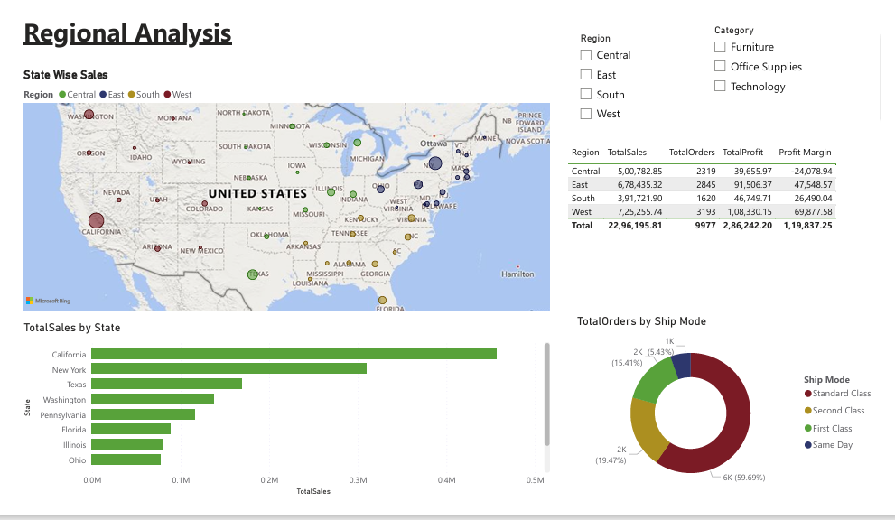

# 🛒 E-Commerce Sales Analysis

## 📌 Project Overview
Analysis of 9,977 rows of Superstore sales data to uncover 
revenue trends, top products, and regional performance.

## 🛠️ Tools Used
- **Microsoft Excel** — Data cleaning & Pivot Tables
- **MySQL** — Database creation & SQL queries
- **Power BI** — Interactive 3-page dashboard

## 📊 Dashboard Pages
1. **Overview** — KPI cards, Sales by Category, Region & Segment
2. **Product Analysis** — Top 10 Sub-Categories, Profit & Discount analysis
3. **Regional Analysis** — State map, Top 10 States, Ship Mode breakdown

## 🔍 Key Insights
- Technology category has the highest profit margin
- West region generates maximum revenue
- High discounts negatively impact profit
- Standard Class is the most used shipping mode

## 📁 Project Structure
ecommerce-analysis/
├── data/
│   ├── superstore_raw.csv
│   └── superstore_cleaned.xlsx
├── sql/
│   ├── 01_create_table.sql
│   └── 02_analysis_queries.sql
├── powerbi/
│   └── ecommerce_dashboard.pdf
└── README.md

## 📸 Dashboard Screenshots

## 👤 Author
**Vivek Siluni**
- Email: vsiluni@gmail.com
- Location: Roorkee, India
